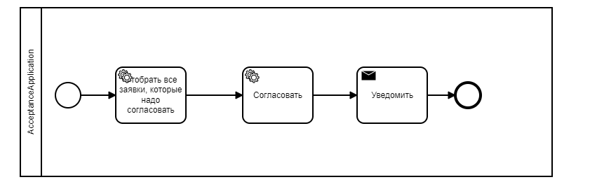
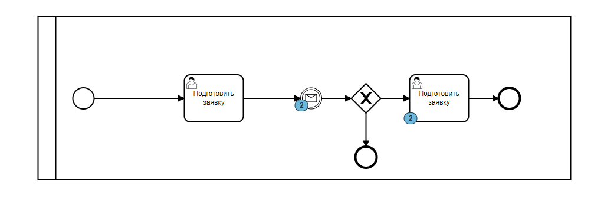

# camunda_send-message

UseFull
* Spring BOOT  
*  Maven

Example:
sending messages from a process to another process that is waiting for it

 `rs.messageEventReceived("WaitAcceptance", subscription.executionId, myVariables)`
 
 Another code with strong process, who waiting
 
 `
rs.createMessageCorrelation("WaitAcceptance")
.processInstanceId(it.processInstanceId)
.setVariable("acceptanceResult", it.acceptanceResult)
.setVariable("Comment", it.comment)
.correlate()`

### Rights
###### set in application.properties
# `camunda.bpm.authorization.enabled=true` 

- При назначении задачи на пользователя или группы выдаются права на
 создание и изменение. См. раздел Авторизации. Например, можно
 настроить критерии задач, которые видны в Task и другой пользователь
 не сможет выполнить задачу, назначенную на ту же группу, но
 находящуюся в работе
- Через интерфейс можно забирать права. Можно попробовать забирать права кодом.

### Use Multiple DB
- The project has a config in which the connection to different
  databases(postgres) is configured, including camunda db, using @bean
  in code. Work with the database goes through Hibernate + JPA